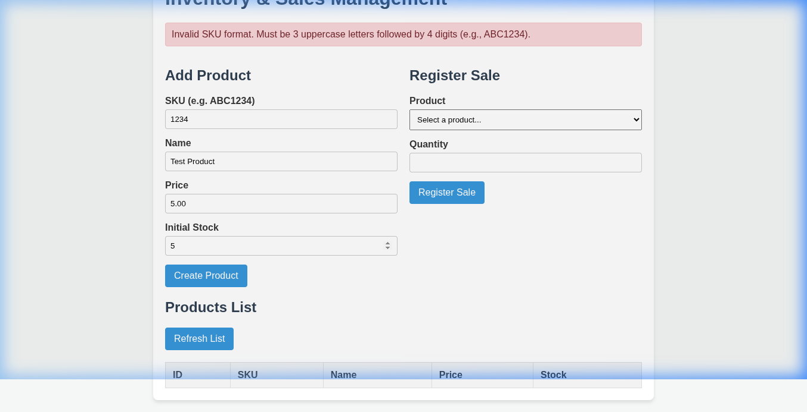
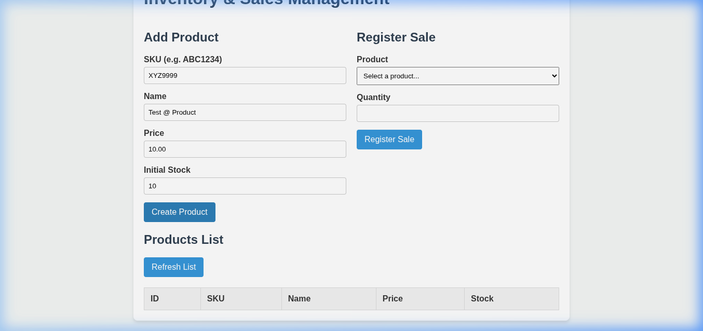
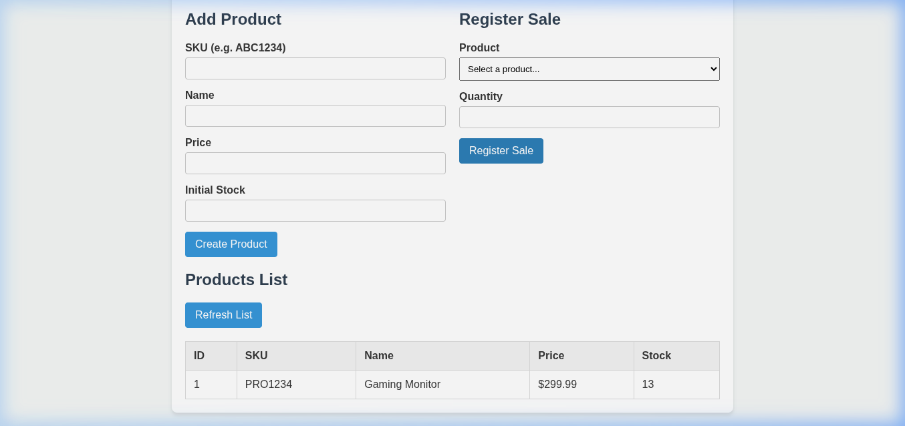
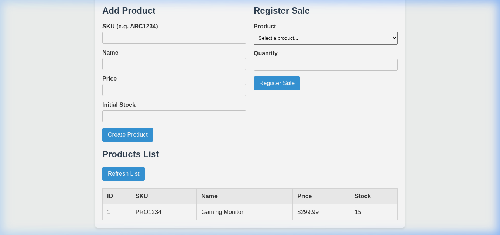

# Sistema de Inventario y Ventas - Flask API

Este proyecto es una aplicación web y API REST para la gestión de productos y registro de ventas. Está construida sobre Flask, utiliza PostgreSQL para la persistencia de datos (mediante Docker) y SQLAlchemy para el control transaccional.

La aplicación incluye un cliente frontend estático (HTML/CSS/JS) integrado y ha sido diseñada bajo estrictos estándares de ingeniería de software, cumpliendo con los siguientes pilares clave:
1. **Internacionalización (i18n)**
2. **Validadores de datos mediante Expresiones Regulares (Regex)**
3. **Control de transacciones ACID en base de datos**
4. **Arquitectura basada en API REST**

---

## Características Implementadas y Evidencias Visuales

### 1. Internacionalización (i18n)
La aplicación utiliza `Flask-Babel` para manejar múltiples idiomas según las cabeceras de idioma del cliente (`Accept-Language`). Los mensajes de error, confirmaciones y textos del sistema se traducen dinámicamente.

* **Evidencia en el código**: Configuración de directorios de traducción en `app.py` y llamadas a la función de traducción `_()` en `models.py` y `routes.py`.
* **Captura de Pantalla**: Al recibir cabeceras en español, los errores de validación del backend se traducen dinámicamente y se presentan al usuario final:



---

### 2. Validadores tipo Regex
Las restricciones de dominio se validan a nivel de modelo en `models.py` antes de cualquier persistencia a la base de datos, garantizando la consistencia e integridad de los datos.

* **SKU**: El SKU debe cumplir estrictamente con el formato de 3 letras mayúsculas seguidas de exactamente 4 números (ej. `ABC1234`).
  * *Regex*: `^[A-Z]{3}\d{4}$`
* **Nombre del Producto**: Solo se permiten letras, números y espacios para evitar caracteres especiales inválidos.
  * *Regex*: `^[A-Za-z0-9\s]+$`

* **Captura de Pantalla (Validación de SKU)**: Intento de agregar un producto con formato SKU incorrecto:


* **Captura de Pantalla (Validación de Nombre)**: Intento de agregar un producto con caracteres especiales no permitidos (`Test @ Product`):



---

### 3. Control de Transacciones
Todas las escrituras e interacciones con la base de datos se manejan bajo el principio ACID. Las operaciones críticas, como el registro de una venta y la reducción automática del stock, se ejecutan en un bloque transaccional atómico. Si ocurre algún error en cualquiera de los pasos (por ejemplo, falta de stock o fallo de persistencia), se realiza un `rollback` automático garantizando que el stock no se reduzca erróneamente.

* **Evidencia en el código**: Bloque de creación de venta en `routes.py`:
  ```python
  # Modificación de stock y registro de venta atómica
  product.stock -= quantity
  new_sale = Sale(product_id=product.id, quantity=quantity, total_price=total_price)
  db.session.add(new_sale)
  db.session.commit() # Confirmación segura de la transacción
  ```

* **Captura de Pantalla (Venta exitosa con descuento de stock)**: Registro de venta de 2 unidades del producto `Gaming Monitor`, descontando correctamente su stock disponible de `15` a `13` en tiempo real:



---

### 4. Uso de API REST
El frontend se comunica con el servidor a través de una API REST limpia y documentada que opera con el formato estándar `application/json`.

#### Endpoints Disponibles:

* **`GET /api/products`**: Recupera el listado completo de productos registrados.
* **`POST /api/products`**: Registra un nuevo producto.
  * *Cuerpo (JSON)*:
    ```json
    {
      "sku": "PRO1234",
      "name": "Gaming Monitor",
      "price": 299.99,
      "stock": 15
    }
    ```
* **`POST /api/sales`**: Registra una venta reduciendo de forma atómica el stock disponible.
  * *Cuerpo (JSON)*:
    ```json
    {
      "product_id": 1,
      "quantity": 2
    }
    ```

* **Captura de Pantalla (Interfaz REST y Lista Actualizada)**: El frontend dinámico interactúa con el endpoint `GET /api/products` para pintar la tabla de forma interactiva tras confirmaciones de creación exitosa:



---

## Guía de Instalación y Ejecución Local

### Requisitos Previos
* Python 3.10 o superior
* Docker y Docker Compose
* Administrador de paquetes `pip`

### Paso 1: Iniciar la Base de Datos PostgreSQL
Levanta el contenedor de PostgreSQL en el puerto `4950` utilizando Docker Compose:
```bash
docker-compose up -d
```

### Paso 2: Configurar el Entorno Virtual de Python
Crea y activa un entorno virtual en la raíz del proyecto, e instala todas las dependencias requeridas:
```bash
python3 -m venv venv
source venv/bin/activate
pip install -r requirements.txt
```

### Paso 3: Ejecutar la Aplicación
Arranca el servidor de desarrollo Flask de manera limpia a través de nuestro archivo de entrada `run.py`:
```bash
python run.py
```

La aplicación estará disponible de inmediato en tu navegador en:
**http://localhost:5001**
