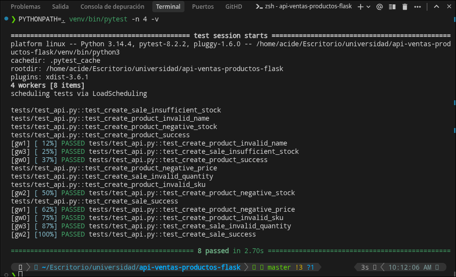

# Guía de Pruebas Automatizadas en Paralelo

Este documento detalla la selección, funcionamiento, e implementación de la capa de pruebas automatizadas con ejecución en paralelo para la API de Ventas y Productos en Flask.

---

## 1. Selección y Funcionamiento de la Herramienta

Para este proyecto, se ha seleccionado **Pytest** en combinación con el plugin **pytest-xdist** para la ejecución en paralelo.

### ¿Cómo funciona la ejecución paralela en Pytest + pytest-xdist?

1. **Creación de Trabajadores (Workers)**: Al lanzar el comando con el parámetro `-n <num_workers>`, `pytest-xdist` genera múltiples procesos independientes de Python (trabajadores) que ejecutan los tests concurrentemente.
2. **Distribución de Carga (Load Scheduling)**: Por defecto, utiliza un programador de carga que envía los tests disponibles a cada trabajador libre.
3. **Aislamiento en Memoria (Base de Datos)**: Para que los tests se ejecuten concurrentemente sin interferir entre sí (condiciones de carrera o borrado de datos cruzados), los fixtures en [tests/conftest.py](file:///home/acide/Escritorio/universidad/api-ventas-productos-flask/tests/conftest.py) configuran una base de datos SQLite efímera e independiente en memoria (`sqlite:///:memory:`) para cada proceso de test, logrando un aislamiento total.

---

## 2. Ejemplo de Ejecución (Suite de Pruebas)

La suite de pruebas en [tests/test_api.py](file:///home/acide/Escritorio/universidad/api-ventas-productos-flask/tests/test_api.py) contiene 8 casos de prueba. Cada uno incluye un retraso artificial de **1 segundo** (`time.sleep(1)`) para demostrar de manera concluyente el beneficio del paralelismo.

### Ejemplo de Caso de Prueba (Venta Exitosa):
```python
def test_create_sale_success(client, app):
    simulate_delay()  # time.sleep(1)
    with app.app_context():
        p = Product(sku="XYZ9876", name="Mouse Gamer", price=25.00, stock=10)
        db.session.add(p)
        db.session.commit()
        product_id = p.id

    response = client.post('/api/sales', json={
        "product_id": product_id,
        "quantity": 3
    })
    assert response.status_code == 201
    
    with app.app_context():
        updated_product = db.session.get(Product, product_id)
        assert updated_product.stock == 7
```

---

## 3. Evidencia de la Ejecución

### Tiempos de Ejecución:
* **Secuencial (Estándar)**: **8.08 segundos** (8 tests x 1 segundo de retraso).
* **Paralelo (4 Workers)**: **2.70 segundos** (distribuido concurrentemente en CPU).

### Ejecución y Comando:
Para ejecutar las pruebas en paralelo con 4 trabajadores:
```bash
PYTHONPATH=. venv/bin/pytest -n 4 -v
```

### Captura de Evidencia:
A continuación se muestra la salida de consola en tiempo real, ilustrando la inicialización de los 4 trabajadores (`gw0` a `gw3`) y la aprobación concurrente de los tests:


