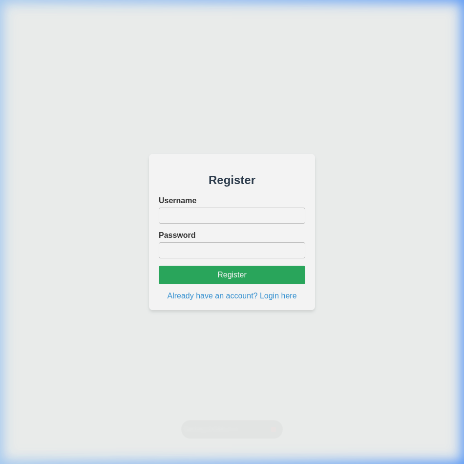
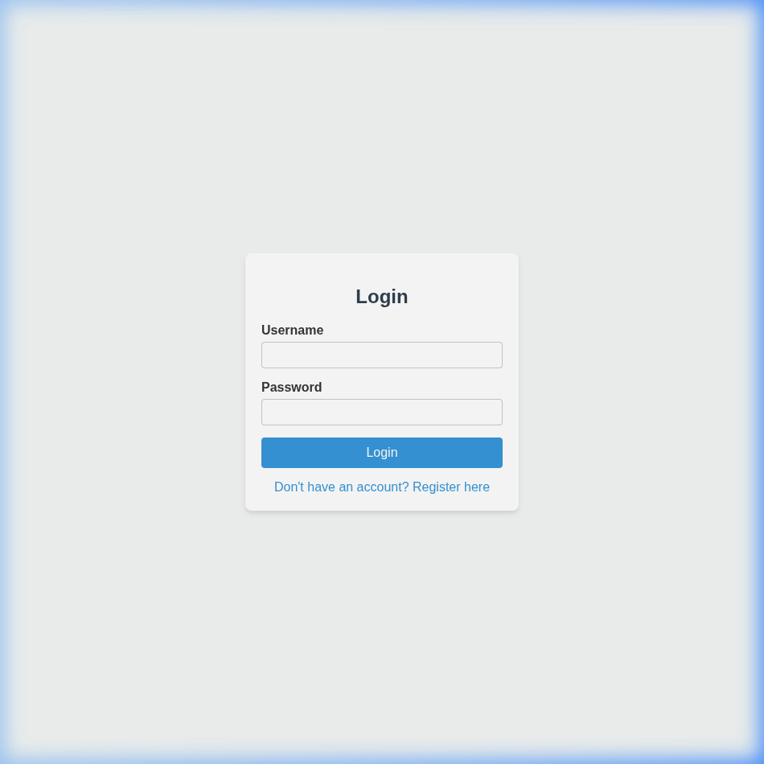
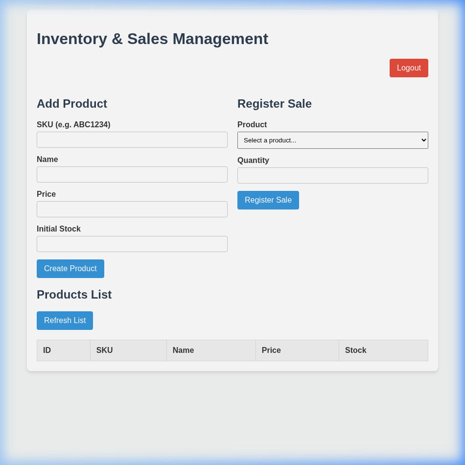

# Evidencia de Implementación: Autenticación JWT

Este documento detalla cómo se ha integrado JSON Web Tokens (JWT) en el proyecto Flask, demostrando su funcionalidad y el flujo de autenticación requerido para consumir la API.

## Resumen de Cambios

1. Se integró la librería `Flask-JWT-Extended` y `Werkzeug` (para el hashing de contraseñas).
2. Se creó el modelo `User` en base de datos.
3. Se añadió el endpoint `POST /api/login` para obtener tokens de acceso.
4. Se protegieron los endpoints `/api/products` y `/api/sales` requiriendo un token Bearer.
5. Se actualizó la capa de pruebas (`test_api.py`) para autenticarse automáticamente antes de cada validación.

---

## Flujo de Autenticación (Ejemplos con cURL)

> [!NOTE]
> Al iniciar la aplicación por primera vez (`python run.py`), se crea automáticamente un usuario administrador por defecto para facilitar las pruebas.
> **Usuario:** `admin`
> **Contraseña:** `admin`

### 1. Intento de acceso sin Token (Error 401)

Si intentamos acceder a un recurso protegido sin estar autenticados, la API nos denegará el acceso.

**Petición:**
```bash
curl -i -X GET http://localhost:5000/api/products
```

**Respuesta Esperada:**
```http
HTTP/1.1 401 UNAUTHORIZED
Content-Type: application/json

{
  "msg": "Missing Authorization Header"
}
```

---

### 2. Login y Obtención del Token (Status 200)

Para obtener un token, debemos autenticarnos contra el servicio de login.

**Petición:**
```bash
curl -i -X POST http://localhost:5000/api/login \
     -H "Content-Type: application/json" \
     -d '{"username":"admin", "password":"admin"}'
```

**Respuesta Esperada:**
```http
HTTP/1.1 200 OK
Content-Type: application/json

{
  "access_token": "eyJhbGciOiJIUzI1NiIsInR5..."
}
```

---

### 3. Acceso Exitoso usando Bearer Token (Status 200/201)

Una vez que tenemos el token, lo enviamos en la cabecera `Authorization` utilizando el esquema `Bearer`.

**Petición:**
```bash
# Reemplazar <TOKEN_AQUI> con el token real obtenido en el paso 2
curl -i -X GET http://localhost:5000/api/products \
     -H "Authorization: Bearer <TOKEN_AQUI>"
```

**Respuesta Esperada:**
```http
HTTP/1.1 200 OK
Content-Type: application/json

[
  {
    "id": 1,
    "name": "Gaming Monitor",
    "price": 299.99,
    "sku": "PRO1234",
    "stock": 15
  }
]
```

## Pruebas Automatizadas

La integración incluye la actualización de los tests unitarios. Ahora, el cliente de pruebas hace login en segundo plano para obtener el token que se envía en cada petición.

```bash
$ PYTHONPATH=. pytest -v
tests/test_api.py::test_create_product_success PASSED                    [ 12%]
tests/test_api.py::test_create_product_invalid_sku PASSED                [ 25%]
tests/test_api.py::test_create_product_invalid_name PASSED               [ 37%]
tests/test_api.py::test_create_product_negative_price PASSED             [ 50%]
tests/test_api.py::test_create_product_negative_stock PASSED             [ 62%]
tests/test_api.py::test_create_sale_success PASSED                       [ 75%]
tests/test_api.py::test_create_sale_insufficient_stock PASSED            [ 87%]
tests/test_api.py::test_create_sale_invalid_quantity PASSED              [100%]

======================== 8 passed in 9.18s ========================
```

## Evidencia Visual del Frontend Funcional

### 1. Pantalla de Registro
Al ingresar sin usuario, se puede acceder al registro de forma independiente (`/register`).



### 2. Pantalla de Login
Una vez registrados (o usando el administrador por defecto), pasamos a la vista de ingreso (`/login`).



### 3. Aplicación y Uso del Token
Al iniciar sesión exitosamente, se carga la interfaz principal. Por debajo, todas las peticiones a la API usan el Token devuelto mediante cabeceras `Authorization: Bearer <TOKEN>`.


